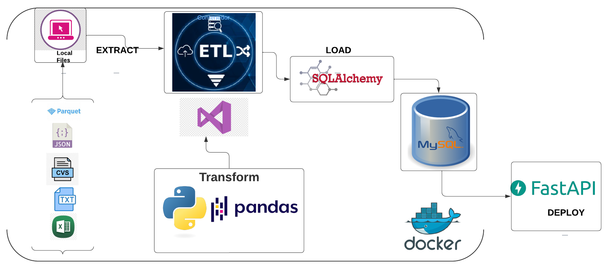
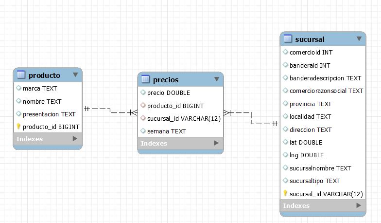
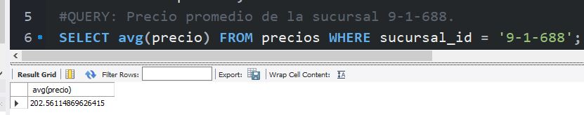
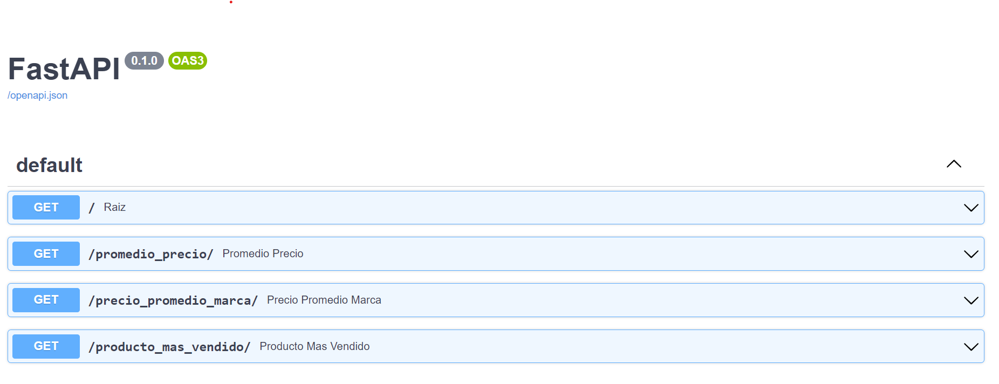

# Henry Labs 1 - Data Engineer 

###  Autor: Elizabeth Flores
email: Elizabeth02fh@gmail.com

Proyecto individual, se realizó todo proceso ETL en 3 días a partir de un conjunto de datos, el cual se centró en la misma perspectiva de negocio. Los datos varían de diversas fuentes de encuestas de precios del año 2020 en diferentes mercados de Argentina.

## Datasets:
En el siguiente link van a poder encontrar los archivos con los que van a trabajar: https://drive.google.com/drive/folders/1Rsq-HHomPtQwy7RIWQ574wKcf56LiGq1?usp=sharing 

## Objetivos:
- Automatizar de ETL a partir de archivos locales en diferentes formatos.  
- Limpieza, Transformación, normalización de datos.
- Carga de datos a mi servidor local (MySQL) con la libreria SQLAlchemy.
- Creacion de DER y bd en MySQL.
- Deploy de la app con FastAPI en entorno local utilizando docker.

## Video explicativo en este link:
[LINK](https://www.youtube.com/watch?v=8NuuhUJACbQ)

## Diagrama de flujo de trabajo ETL.


## La base de datos generada finalmente se muestra así:


### query
Finally, a query was made to verify if the database works: Average price of the 9-1-688 branch, which resulted in:203.64690382081687.


### Instalación de containers:
### 1. Deploy de container en FastAPI en docker -->
[LINK](https://fastapi.tiangolo.com/deployment/docker/)
- Instalación: En el archivo docker-compose.yml
```rb
version: '3'
services:
  my_app:
    build:
      context: .
      dockerfile: Dockerfile
    ports:
      - "80:80"
    volumes:
      - ./app:/code/app
    command: uvicorn app.main:app --host 0.0.0.0 --port 80
```
- En el archivo dockerfile
```rb
FROM python:3.9
WORKDIR /code
COPY ./requirements.txt /code/requirements.txt
RUN pip install --no-cache-dir --upgrade -r /code/requirements.txt
COPY ./app /code/app
CMD ["uvicorn", "app.main:app", "--host", "0.0.0.0", "--port", "80"]
```
- Instalación: En el archivo requirements.txt
```rb
fastapi>=0.68.0,<0.69.0
pydantic>=1.8.0,<2.0.0
uvicorn>=0.15.0,<0.16.0
pandas
numpy
```
Luego de tener el dataframe limpios y bonitos, se debe instalar docker, y FastApi recomendable instalar docker desktop.

En powershell de visual studio, nos ubicamos en nuestra carpeta donde estan los archivos de este repositorio para ejecutar el docker-compose que va a levantar la imagen, el contenedor, el puerto de salida y el volumen en nuestro localhost:
```rb
docker-compose up -d
```
Una vez ejecutado el comando anterior, nos podemos dirigir a la API que se encuentra corriendo en nuestro localhost en el siguiente link http://localhost/docs.


- POR OTRO LADO, si no se utliza un docker-compose, para crear la imagen:
```rb
docker build -t myimage .
```
- para crear el contenedor:
```rb
docker run -d --name mycontainer -P 80:80 myimage
```
- para ver si esta corriendo el contenedor:
```rb
docker ps
```
- para ver si se creó la imagen:
```rb
docker image ls
```
- en caso de los contenedores tanto en modo up y exited:
```rb
docker ps -a
```
